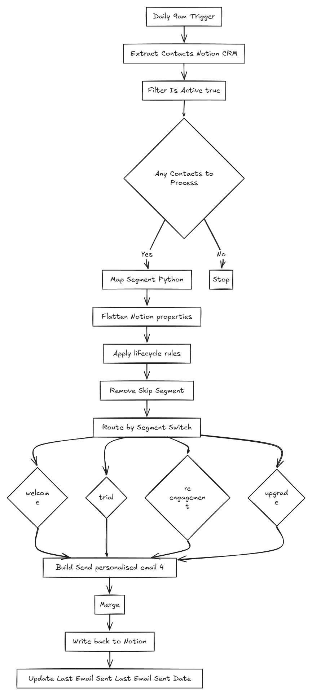

# 📧 Email Lifecycle Automation — Notion CRM

> Daily n8n workflow that reads a Notion CRM, segments every active contact by lifecycle state using Python, sends personalised emails, and writes results back — all automated.

---

## What It Does

Runs every day at 9am. For each active contact in a Notion database it:

1. Evaluates lifecycle state against four segmentation rules
2. Skips contacts that don't match any rule
3. Builds a personalised email per segment
4. Sends via SMTP
5. Writes `Last Email Sent` and `Last Email Sent Date` back to Notion
6. Logs a run summary

---

## Architecture



---

## Segmentation Logic

Evaluated per contact in this priority order:

| Segment | Condition | Target |
|---|---|---|
| `welcome` | `signup_date == today` | New signups |
| `trial_expiry` | `trial_end_date == today + 3 days` | Expiring trials |
| `re_engagement` | `last_login > 30 days ago` AND plan is `pro/team/enterprise` | Churning paid users |
| `upgrade_offer` | `last_login > 30 days ago` AND plan is `free` | Inactive free users |
| `skip` | None of the above | Not emailed |

---

## Node Reference

| Node | Type | Purpose |
|---|---|---|
| `Daily 9AM Trigger` | Schedule | Cron `0 9 * * *` |
| `Extract Contacts from Notion` | Notion | Reads all pages where `Is Active = true` |
| `Any Contacts to Process?` | IF | Short-circuits if Notion returns empty |
| `Map & Segment Contacts` | Code (Python) | Flattens Notion properties, applies segmentation rules |
| `Remove Skip Segment` | Code (Python) | Filters contacts labelled `skip` |
| `Route by Segment` | Switch | Routes to one of four branches by `email_type` |
| `Build Welcome Email` | Code (Python) | Composes subject + body for new signups |
| `Build Trial Expiry Email` | Code (Python) | Composes urgency email for expiring trials |
| `Build Re-engagement Email` | Code (Python) | Composes win-back for inactive paid users |
| `Build Upgrade Offer Email` | Code (Python) | Composes upgrade pitch for inactive free users |
| `Send * Email` (×4) | Email (SMTP) | Sends the built email |
| `Merge` | Merge | Recombines all four branches |
| `Write-back to Notion Contact` | Notion (update) | Updates `Last Email Sent` + `Last Email Sent Date` |
| `Run Summary` | Code (Python) | Aggregates counts and logs the run |

---

## Notion CRM Schema

Required columns in the `notion_crm_contacts` database:

| Property | Type | Used For |
|---|---|---|
| `Name` | Title | Email personalisation |
| `Email` | Email | Send target |
| `Plan` | Select | Distinguishing paid vs free for inactive routing |
| `Signup Date` | Date | Welcome email trigger |
| `Last Login` | Date | Inactivity calculation |
| `Trial End Date` | Date | Trial expiry trigger |
| `Custom Link` | URL | Injected into email body |
| `Interests` | Text | Email personalisation |
| `Is Active` | Checkbox | Filter — only active contacts are processed |
| `Last Email Sent` | Select | Written back after send (template name) |
| `Last Email Sent Date` | Date | Written back after send (timestamp) |

---

## Email Payloads

Each Python builder outputs:

```python
{
    "to": "user@example.com",
    "name": "Alice Johnson",
    "subject": "Welcome to the platform, Alice!",
    "body": "...",
    "template_name": "welcome",
    "user_id": "notion-page-id",
    "_notion_page_id": "notion-page-id"
}
```

The `_notion_page_id` field is carried through to the write-back node to identify which Notion record to update.

---

## Setup

1. **Import** the workflow JSON into n8n
2. **Connect credentials:**
   - Notion integration (must be shared with the CRM database)
   - SMTP account for email delivery
3. **Update** the `databaseId` in the Notion node to your actual database ID
4. **Verify** your Notion database has all required columns (see schema above)
5. **Activate** the workflow

---

## Request Access

The full workflow JSON is available on request.

connect via [LinkedIn](https://www.linkedin.com/in/tejasv-makkar/).

---

## Tech Stack

- **n8n** — workflow automation engine
- **Notion** — CRM and data source
- **Python** — segmentation and email construction logic
- **SMTP** — email delivery
